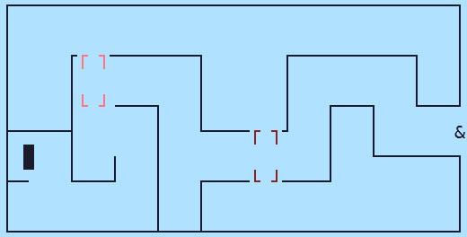
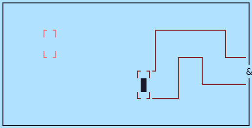
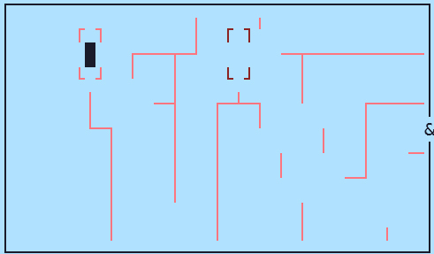
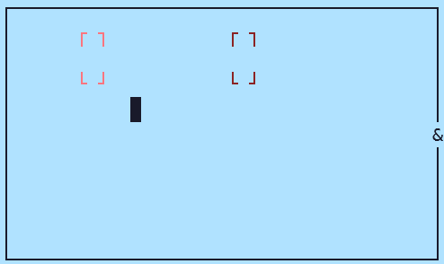
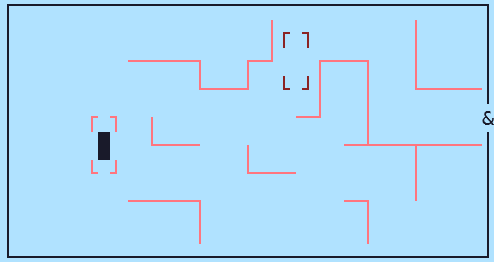
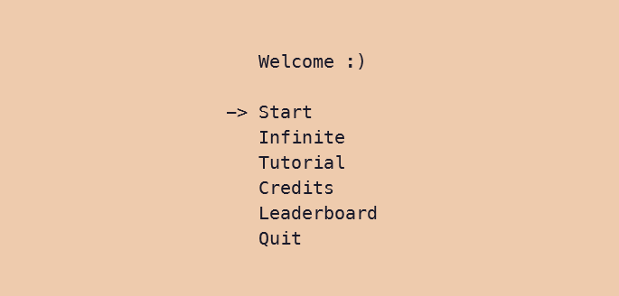

# Getting Inside The Box

This game is developed by the team -  [**Benevolent-Bonobos**](##About-Us) , during the [sumer code jam 2021](https://pythondiscord.com/events/code-jams/8/) held by [python discord](https://discord.com/invite/python).

Teams participated in the code jam had to create a TUI based on the theme "Think Inside the Box". 

## Contents
- [How To Play](##How-To-Play)
- [Requirements](##Requirements)
- [Installation](##Installation)
- [Screenshots](##Screenshots)
- [Future Improvements](##Future-Improvements)
- [About Us](##About-Us)

<!--- This can go now that How To Play covers everything
### Normal mode

- with 9 levels

### Infinite mode

- with infinite levels
- no ending
- press `q` to quit --->

## How To Play
<!-- Insert the tutorial we made in the game here?-->
<!-- The video goes here? -->
1. There are 6 options in start menu:
    - Start: To play normal level.
    - Infinite: To play infinite mode.
    - Tutorial: To know how to play.
    - Credits
    - Leaderboard 
    - Quit 
2. Use `Arrow Keys` to move.
3. At starting, a glimpse of whole maze will be shown. After it disappears, game will start.
4. Player has to reach `&` with minimum collision with wall and in minimum time.
5. Boxes:
    - It is the place to stop and think.
    - It will show part of the maze associated with the box.
    - Time slows down here.
6. Echo:
    - Press `e` to make a noise.
    - An echo will come from the direction in which player last moved.
    - Echo will get stronger as player is nearer to wall.
7. Persistence:
    - It acts as a score for a player.
    - Higher it is, better it is.
    - It will decrease with time.
    - It will decrease much more with each collision.
    - Since, time slows down in box, Persistence will decrease in lower rate inside the box.
    - It is placed in right top corner.
8. In left top corner, Number of collisions in each level is shown.
9. By pressing `q`, game will be paused. There will be an option to "Play again" or "Quit".
10. In normal level, a player can play 9 levels.
11. In infinite level, a player have to press `q` for quitting.
12. After completing level, a player, if wants, can put his/her name in `LeaderBoard` with his\her score.

## Requirements

- Python 3.8.6 or greater
- A stereo headset
- The terminal window should be sufficiently large (At least 50 x 15 characters in width and height). You should not resize the terminal during the game.

## Installation

### 1. Clone the repository

```sh
git clone https://github.com/Anand1310/summer-code-jam-2021.git
```

### 2. Install required dependency

#### Windows
<!-- Not sure abour Mac-->
```sh
pip install -r dev-requirements.txt
```

#### Linux
```sh
apt-get install openal-soft
pip3 install -r dev-requirements.txt
```

### 3. Run the game

#### Window

```sh
python main.py
```

#### Linux

```sh
python3 main.py
```


  ##### Note: A player can visit `Tutorial` for better understanding of the game.
  
## Screenshots 













## Future Improvements
- Reveal the map with animation at the start of the round.
- Allow player to move during echo.
- Fix bug: Hitting leaderboard in the main menu exits game.
- Fix bug: Hitting Main menu in `end_scene` doesn't refresh the window.

## About Us:


<!--Add your own github link here-->
- [Anand]()
- [Pritam Dey](https://github.com/pritam-dey3)
- [Himi]()
- [Olivia]()
- [StoneSteel](https://github.com/StoneSteel27)
- [Jason Ho](https://github.com/Jason11ookJJ)

## Video
